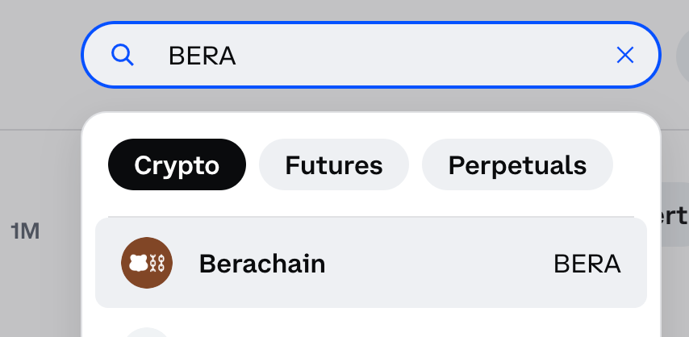

# 📉 Shorting

## **Dynamic Valuation & The Price Discovery Dilemma**

Honey Chat allows users to bet on their peers' decline in popularity. This not only enriches the platform with **financial strategy** but also mirrors the transient nature of real-world **social standings**. It's all about **quantifying** the worth of **social interactions**, **content**, and **influence** _in real-time_.

Here is Bera Grylls explaining shorting using **Charts** and **Keys** below. He also uses **Pictures** and **Stories** for those who (ahem) prefer to digest information via children's parables.  

<figure><figcaption></figcaption></figure>

### 1. Little Jimmy Bera goes a-shorting:

<figure><figcaption>
“In this scenario, Little Jimmy Bera <strong>shorts 10 passes</strong> with a <strong>starting supply</strong> of <strong>100 passes</strong>. As a result, <strong>the supply</strong> decreases to <strong>90 passes</strong> after his short. Being a bear of very little brain, he sets a <em>minimum</em> <strong>safety margin</strong> of <strong>5 passes</strong>. So he provides collateral for the passes from 90 to 105. If the pass supply reaches 95, Jimmy Bera will be subject to liquidation... and thus. . . rekt-age. He <em>could</em> adjust his safety margin at any time, but he <em>instead</em> chooses to live dangerously.”
</figcaption></figure>

### 2. Little Jimmy Bera goes a-winning:

<figure><figcaption>
“Here, Little Jimmy Bera decides to close his short after the <strong>pass supply</strong> has reached <strong>75</strong>. His <strong>collateral</strong> is used to <strong>buy back</strong> the <strong>10 passes</strong> he shorted and the pass supply adjusts to 85. Jimmy Bera receives the <em>full amount</em> of his collateral back <em><strong>plus</strong></em> the <strong>original basis</strong> of his short <em><strong>minus</strong></em> the cost of the 10 shares he bought back. Little Jimmy Bera swells with pride and social signals his good fortune via a public post."
</figcaption></figure>

### 3. Little Jimmy Bera gets a-rekt (minds outta the gutter; this is for kids):

<figure><figcaption>
“Here, Little Jimmy Bera is <strong>liquidated</strong> after the pass supply <em>rises</em> to <strong>95</strong>. With sad little teardrops dampening his face, Jimmy Bera watches as his <strong>collateral</strong> is used to <em>buy back</em> the <strong>10 passes he shorted</strong> and the <strong>pass supply</strong> <em>returns</em> to <strong>105</strong>. Jimmy Bera receives <strong>the remainder of his collateral</strong> <em>after</em> the amount needed to purchase passes 90 to 95 has been deducted. He numbs his pain by binge watching Cake Boss. It is a sad day for Little Jimmy Bera.”
</figcaption></figure>
